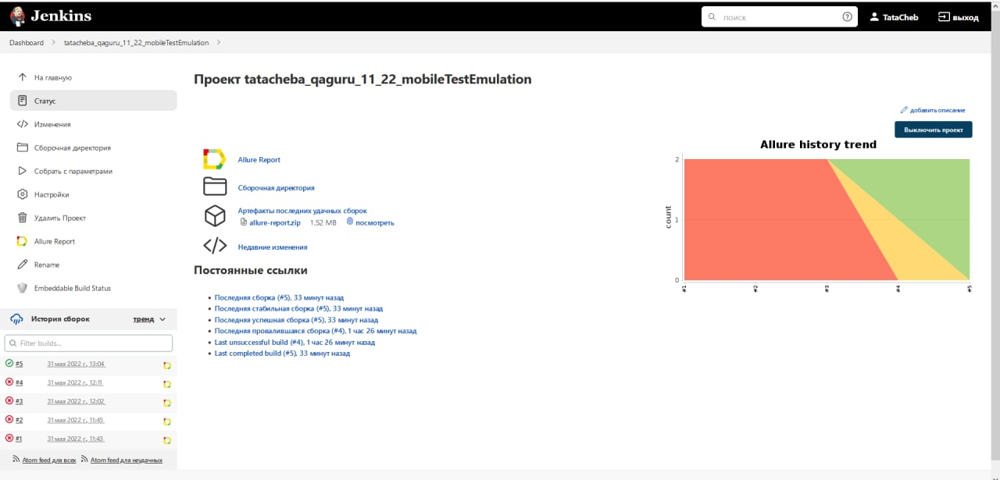
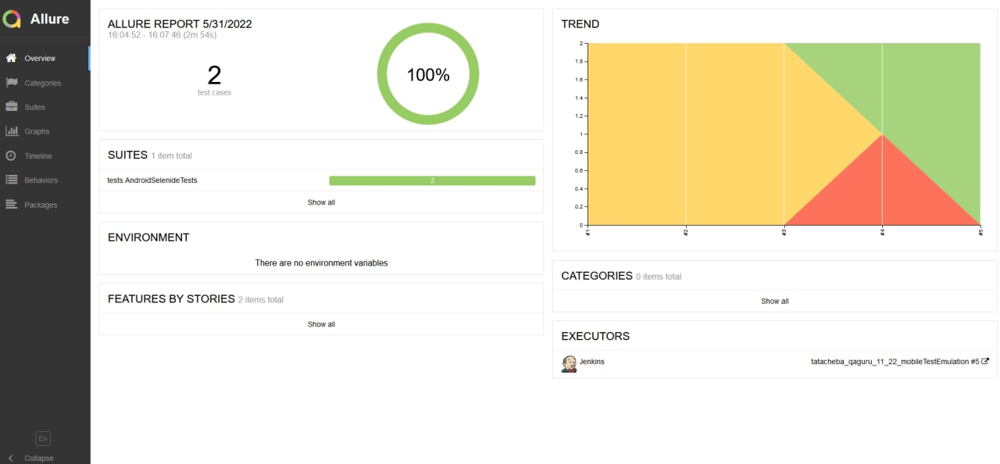
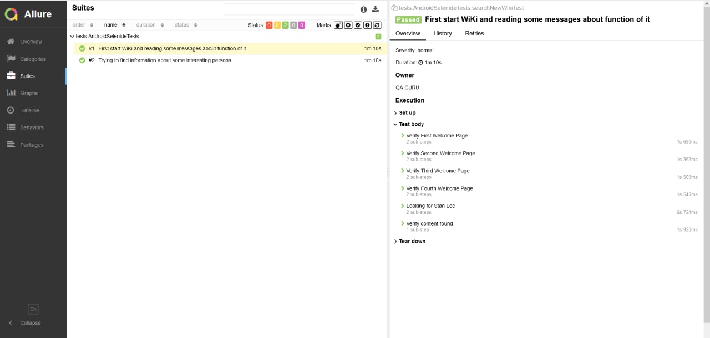
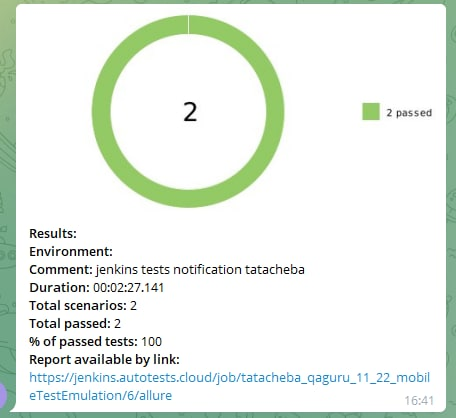

# Test automation project for Wikipedia mobile application

## 📃 Content:

-   [Technologies and tools](#tehnologist)
-   [Verified checks](#Verified_checks)
-   [Run tests from the terminal](#computer)
-   [Running Tests in Jenkins](#running_tests)
-   [Отчет в Allure report](#report_allure_report)
-   [Отчет в Telegram](#notifications_telegram_bot)

## <a name="technologist"> Technologies and tools</a>

<p align="center">


</p>

## <a name="verified">Verified checks</a>

-   Check launch screens and search in the app

## <a name="computer">Run tests from the terminal</a>

Local start on emulator:

```
gradle clean test -Ddevice=emulator
```

Local startup on a real device:

```
gradle clean test -Ddevice=real
```

Running in Browserstack:

```
gradle clean test -Ddevice=browserstack
```

## <a name="running_tests">Running Tests in [Jenkins](https://jenkins.autotests.cloud/job/tatacheba_qaguru_11_for_interview)</a>

<p align="center">
<a href="https://jenkins.autotests.cloud/job/tatacheba_qaguru_11_22_mobileTestEmulation/"></a>
</p>

### Build features in Jenkins:

-   The assembly can be run through Browserstack, Appium, and a real connected phone.

## </a> Отчет в <a target="_blank" href="https://jenkins.autotests.cloud/job/C11-eisritter-unit13-homework/allure">Allure report</a>

### Main

<p align="center">

</p>

### Tests

<p align="center">

</p>

##  <a name="notifications_telegram_bot">Notifications in Telegram using a bot</a>

<p align="center">

</p>

## </a> Video example of passing the test

<p align="center">
 
</p>
